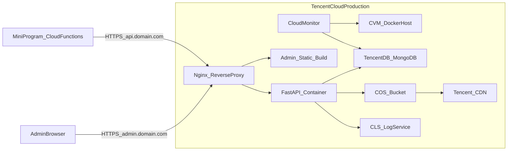

# Phase 5 腾讯云部署和上线详细方案

## 目标与范围

- 将 `my-car-admin`（FastAPI 后端 + React 管理台）部署到腾讯云生产环境。
- 提供公网 HTTPS API 给小程序云函数调用。
- 保证可观测、可回滚、可持续发布。

涉及代码与配置路径：
- [my-car-admin/backend/.env.example](/Users/lfy/project/my-car/my-car-admin/backend/.env.example)
- [my-car-admin/backend/requirements.txt](/Users/lfy/project/my-car/my-car-admin/backend/requirements.txt)
- [my-car-admin/frontend/package.json](/Users/lfy/project/my-car/my-car-admin/frontend/package.json)
- [cloudfunctions/api-home/index.js](/Users/lfy/project/my-car/cloudfunctions/api-home/index.js)
- [cloudfunctions/api-wallpapers/index.js](/Users/lfy/project/my-car/cloudfunctions/api-wallpapers/index.js)
- [cloudfunctions/api-sounds/index.js](/Users/lfy/project/my-car/cloudfunctions/api-sounds/index.js)
- [cloudfunctions/api-search/index.js](/Users/lfy/project/my-car/cloudfunctions/api-search/index.js)
- [docs/DEPLOY.md](/Users/lfy/project/my-car/docs/DEPLOY.md)

## 架构落地

## Phase 5 分步实施

### 1) 购买与开通腾讯云资源

- 购买 1 台 CVM（建议最低 2C4G，系统 Ubuntu 22.04）。
- 购买 TencentDB for MongoDB（建议副本集，生产至少 20GB）。
- 开通 COS（用于媒体文件统一存储），开通 CDN（媒体分发）。
- 申请 SSL 证书（腾讯云 SSL，可先 DV 免费证书）。
- 购买域名并完成备案（国内服务器需要）。

推荐资源命名：
- CVM: `mycar-prod-cvm`
- Mongo: `mycar-prod-mongo`
- COS Bucket: `mycar-prod-media`
- 域名: `admin.xxx.com`（管理台），`api.xxx.com`（后端 API）

### 2) 网络与安全基线配置

- 安全组放行端口：`22`（白名单 IP）、`80`、`443`。
- MongoDB 仅允许 CVM 内网或固定出口访问。
- CVM 系统初始化：
  - 创建非 root 运维用户
  - 配置 SSH key 登录
  - 开启 UFW/iptables 最小暴露
- NTP 时间同步与时区统一（建议 UTC 或 Asia/Shanghai）。

### 3) CVM 安装运行时

- 安装 Docker 与 Docker Compose。
- 安装 Nginx（可容器化，也可宿主机部署，二选一，推荐容器化统一管理）。
- 创建部署目录结构：
  - `/opt/mycar/backend`
  - `/opt/mycar/frontend`
  - `/opt/mycar/nginx`
  - `/opt/mycar/deploy`

### 4) 应用打包与发布策略

- 后端构建：基于 `backend/requirements.txt` 制作镜像。
- 前端构建：`npm run build` 产物通过 Nginx 静态托管。
- 镜像仓库方案二选一：
  - 优先 Tencent TCR（统一腾讯云权限）
  - 或 GitHub Actions + 自建仓库
- 发布流程：
  - 打版本标签（例如 `v1.0.0`）
  - 构建镜像并推送
  - CVM 拉取新镜像并滚动重启

### 5) 生产环境变量与密钥

后端 `.env` 必填建议项：
- `ENV=prod`
- `JWT_SECRET_KEY=<强随机密钥>`
- `MONGO_URI=<TencentDB连接串>`
- `MONGO_DB_NAME=my_car_admin`
- `MEDIA_BASE_URL=https://cdn.xxx.com`
- `UPLOAD_DIR=/data/uploads`

云函数环境变量（四个函数一致）：
- `ADMIN_API_BASE_URL=https://api.xxx.com/api/v1`
- `ADMIN_PUBLIC_TOKEN=<可选，若启用公共接口鉴权>`

### 6) Nginx 域名与 HTTPS 配置

- `admin.xxx.com`:
  - `/` -> 前端静态资源
  - SPA 路由回退 `index.html`
- `api.xxx.com`:
  - `/api/v1/*` -> FastAPI 容器
  - 开启 gzip、合理超时与请求体限制
- 配置 SSL 证书并开启：
  - HTTP 强制跳转 HTTPS
  - TLS 1.2+，禁用弱加密套件

### 7) 数据与媒体迁移

- Mongo 数据准备：
  - 导入 brands/banners/wallpapers/sounds 基础数据
  - 确认索引（与 `docs/DEPLOY.md` 对齐）
- 媒体文件迁移：
  - 统一上传至 COS
  - 数据库中的 `coverUrl/originUrl/audioUrl/logo` 替换为 CDN 域名

### 8) 小程序联调与灰度

- 在微信云开发控制台更新 4 个云函数环境变量。
- 重新部署：`api-home`、`api-wallpapers`、`api-sounds`、`api-search`。
- 云函数云端测试：
  - `api-home` 空参数返回 `code:0`
  - `api-wallpapers` `action:list`
  - `api-sounds` `action:list`
  - `api-search` `action:hot`
- 小程序端回归：
  - 首页、壁纸、音效、搜索、详情页全部走真实数据

### 9) 监控、日志与告警

- 接入 CLS：Nginx 访问日志、后端应用日志。
- Cloud Monitor 告警：
  - CVM CPU/内存/磁盘阈值
  - API 5xx 比例、响应时延
  - Mongo 连接数与慢查询
- 关键业务指标：
  - 首页成功率
  - 搜索成功率
  - 壁纸/音效详情请求成功率

### 10) 上线验收与发布

上线前验收清单：
- 管理后台可登录、CRUD 正常。
- 小程序核心链路可用（首页、列表、详情、搜索）。
- HTTPS 证书、域名、跨域策略正常。
- 云函数与后端链路稳定，无大量 5xx。

发布策略：
- 先灰度（小程序灰度发布）
- 观察 24h 指标后全量

### 11) 回滚方案

- 应用回滚：
  - 保留上一版镜像 tag，`docker compose` 回退镜像版本。
- 小程序回滚：
  - 微信公众平台“版本回退”到上一稳定版本。
- 数据回滚：
  - TencentDB 自动备份恢复到指定时间点。

## 交付物（Phase 5）

- 部署脚本与配置：
  - `docker-compose.prod.yml`
  - `nginx/prod.conf`
  - `backend/.env.prod.example`
- 测试文件：
  - `tests/phase5/phase5_test_plan.md`
  - `tests/phase5/deploy_verification_checklist.md`
  - `tests/phase5/online_smoke_test.sh`
- 运维文档：
  - 域名证书更新说明
  - 发布/回滚 SOP

## 时间建议（可执行排期）

- D1：资源购买与网络基线
- D2：容器化部署与域名证书
- D3：数据迁移与云函数联调
- D4：灰度与监控告警上线
- D5：全量发布与验收归档
