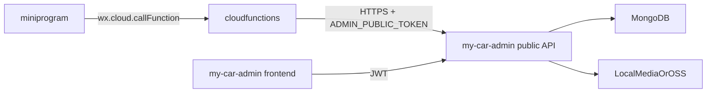

# 开发指南

## 环境要求

- 微信开发者工具 >= 1.06
- Node.js >= 18.0
- 基础库版本 >= 3.0

## 快速开始

### 1. 克隆项目

```bash
git clone https://github.com/lfy539/my-car.git
cd my-car
```

### 2. 配置云开发环境

1. 打开微信开发者工具
2. 导入项目，选择 `my-car` 目录
3. 在 `project.config.json` 中填入你的 AppID
4. 开通云开发，创建环境
5. 在 `miniprogram/app.ts` 中配置环境 ID

### 3. 初始化云函数

```bash
# 进入云函数目录
cd cloudfunctions/api-health
npm install

cd ../api-user
npm install
```

### 4. 部署云函数

在微信开发者工具中：
1. 右键点击 `cloudfunctions` 目录
2. 选择"上传并部署：云端安装依赖"

### 5. 创建数据库集合

在云开发控制台创建以下集合：
- `users` - 用户表
- `wallpapers` - 壁纸表
- `sounds` - 音效表
- `brands` - 品牌表
- `car_models` - 车型表
- `user_favorites` - 用户收藏表
- `user_events` - 用户行为表

## 项目结构

```
my-car/
├── miniprogram/           # 小程序代码
│   ├── pages/             # 页面
│   ├── components/        # 组件
│   ├── styles/            # 样式
│   ├── utils/             # 工具函数
│   ├── services/          # API 服务
│   ├── stores/            # 状态管理
│   └── assets/            # 静态资源
├── cloudfunctions/        # 云函数
│   ├── api-health/        # 健康检查
│   └── api-user/          # 用户相关
├── typings/               # 类型定义
├── docs/                  # 文档
└── project.config.json    # 项目配置
```

## 开发规范

### 代码风格
- 使用 TypeScript
- 使用 SCSS 编写样式
- 组件使用 PascalCase 命名
- 文件使用 kebab-case 命名

### Git 提交规范
- `feat`: 新功能
- `fix`: 修复 bug
- `docs`: 文档更新
- `style`: 代码格式
- `refactor`: 重构
- `test`: 测试
- `chore`: 构建/工具

## 调试技巧

### 查看云函数日志
1. 打开云开发控制台
2. 进入"云函数" -> "日志"
3. 选择对应云函数查看

### 测试接口健康度
1. 进入"我的"页面
2. 点击"接口健康检查"
3. 查看返回结果

## 常见问题

### Q: 云函数调用失败
A: 检查云开发环境 ID 是否正确，云函数是否已部署

### Q: 样式不生效
A: 检查 SCSS 文件是否正确导入变量文件

### Q: TypeScript 报错
A: 检查 typings 目录下的类型定义是否完整

---

## 架构联动说明（Phase 6）

本节说明 `miniprogram`、`cloudfunctions`、`my-car-admin` 三者的职责边界、调用关系与联调约束。

### 三端关系图



### 职责边界

- `miniprogram`：只做页面展示与交互，统一通过 `wx.cloud.callFunction` 调用服务能力。
- `cloudfunctions`：作为小程序 BFF 代理层，负责参数转发、统一返回体、错误码映射和基础鉴权隔离。
- `my-car-admin`：
  - 后台前端用于运营管理；
  - 后台后端既提供管理接口（需 JWT），也提供小程序公共接口（`/api/v1/public/*`）。

### 当前真实调用链（基于代码）

- 首页：`api.getHomeData` -> `api-home` -> `GET /api/v1/public/home`
- 壁纸：`getWallpapers/getWallpaperDetail` -> `api-wallpapers` -> `GET /api/v1/public/wallpapers*`
- 音效：`getSounds/getSoundDetail` -> `api-sounds` -> `GET /api/v1/public/sounds*`
- 搜索：`getSearchSuggestions/search/getHotKeywords` -> `api-search` -> `GET /api/v1/public/search*`

### 数据一致性约束

- 单一事实源：所有展示数据以 `my-car-admin` 数据库为准。
- 字段约束：`status` 上架规则在后端 `public` 接口统一过滤（例如 `status=1` 才对外）。
- 写入路径：内容新增/修改应仅经后台管理端完成，小程序端只读公共内容。

### 接口版本与契约

- 统一版本前缀：`/api/v1/...`。
- 变更策略：
  - 新增字段允许向后兼容；
  - 删除或重命名字段必须先保留兼容窗口，再执行双端切换。
- 云函数返回体约定：
  - 成功：`{ code: 0, message: "success", data, timestamp }`
  - 失败：使用云函数层统一错误码（如 `1001` 参数错误、`3001` 资源不存在、`5001` 后端失败）。

### 错误码映射建议

- 后端 `404`（资源不存在）-> 云函数 `3001`。
- 后端网络异常/超时 -> 云函数 `5001`。
- 参数缺失/非法 -> 云函数 `1001`。
- 小程序最终只依赖云函数统一错误结构，不直接耦合后端 HTTP 状态码。

### 联调与排障顺序

1. 后端健康检查：`GET /api/v1/health`
2. 后端公共接口：`/public/home`、`/public/wallpapers`、`/public/sounds`、`/public/search/hot`
3. 云函数代理函数（4 个核心函数）云端测试
4. 小程序页面联调（首页 -> 列表 -> 详情 -> 搜索）

排障链路建议：

- 小程序报错信息 -> 云函数日志 -> 后端日志 -> 数据库数据校验。
- 建议透传 `requestId`（由云函数生成）到后端日志，便于跨层追踪。
